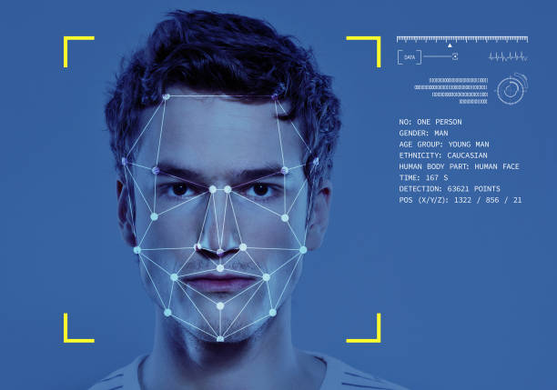
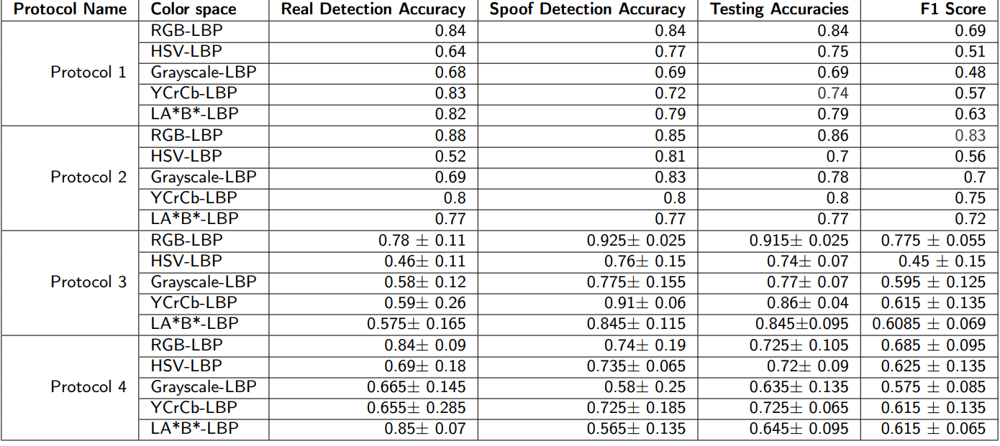
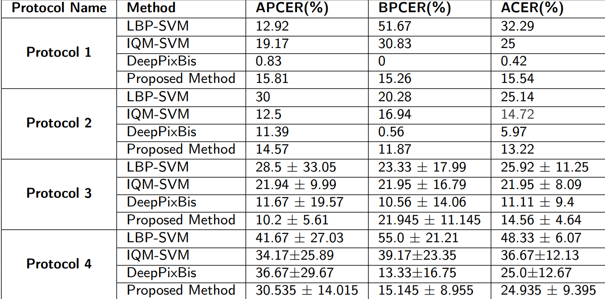
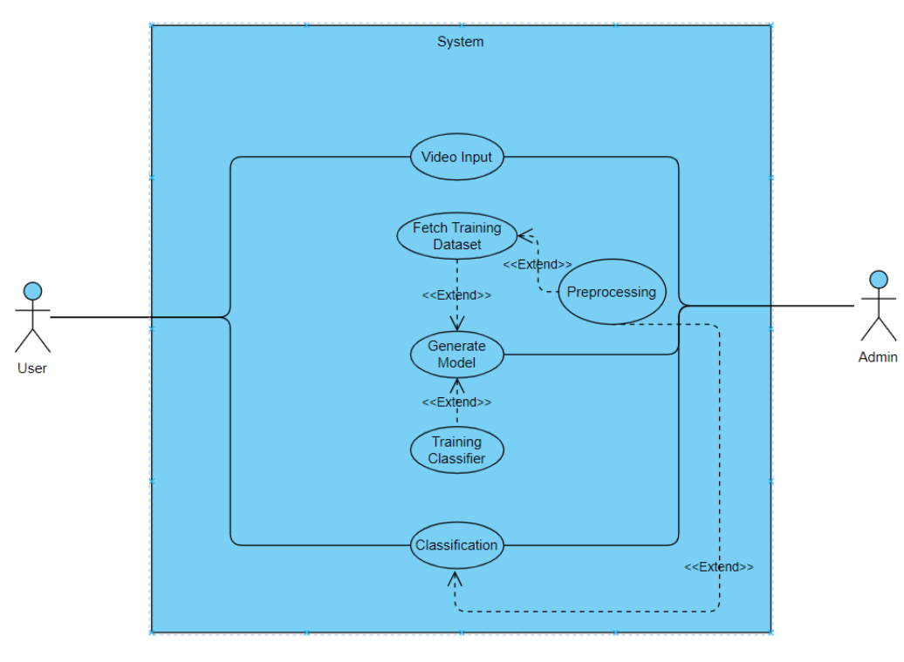
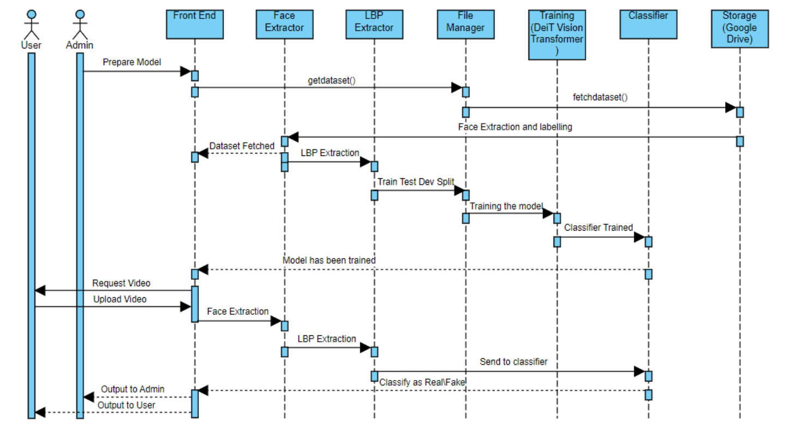
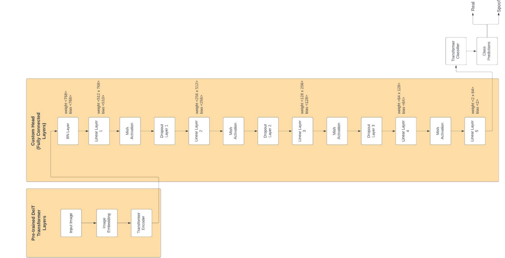
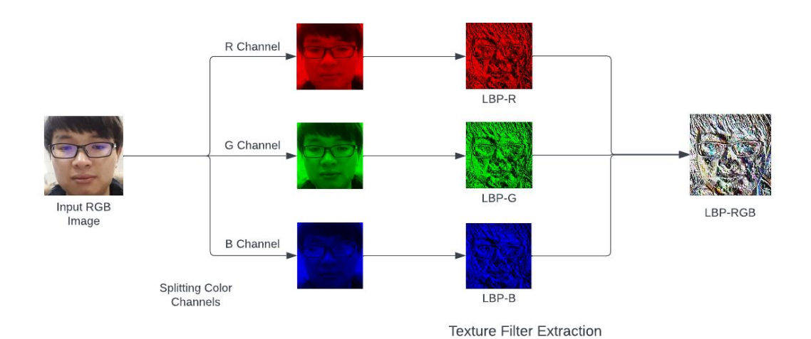
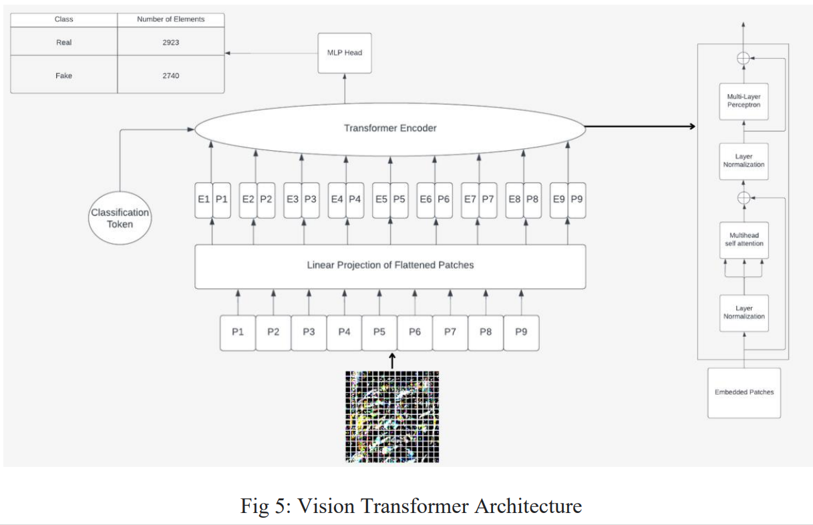

<p align="center"> 
    </img>
</p>

<h1 align="center"> Face Spoof Detection 🪪📸</h1> 
<h3 align="center"> Leveraging Vision Transformers for Robust Face Presentation Attack Detection.</h3>

<p align="center">
    <a href="https://www.python.org/"></a>
    <a href="https://pandas.pydata.org/"></a>
    <a href="https://numpy.org/"></a>
    <a href="https://scikit-learn.org/stable/"></a>
    <a href="https://pytorch.org/"></a>
</p>

<!-- <p align="center">If you want to discuss something, you can ask on my <a href="https://discord.com/invite/GkcbM5bwZr">Discord Server</a>.</p> -->

# 🖥️ Installation & Setup ⚙️

## Prerequisites

- Anaconda : Ensure that Anaconda is installed on your computer. Download from [Anaconda](https://www.anaconda.com/download)  
  check the installation by running the following command in the terminal:

  ```
  conda
  ```

  **Note:** In windws, you have to use Anaconda Prompt to run the above command and use conda commands

- Visual Studio Code : Ensure that Visual Studio Code is installed on your computer. Download from [VS Code](https://code.visualstudio.com/download)

## Creating a new environment

1. Creating a Conda Environment  
   Open your terminal (or Anaconda Prompt for Windows users) and execute the following command to create a new Conda environment. Replace env_name with your preferred name for the environment.

   ```bash
   conda create --name env_name python
   ```

2. Activating the Environment  
   Activate the newly created environment by running:

   ```bash
   conda activate env_name
   ```

3. Installing Packages 🛠️  
   Install the required packages using the following commands (make sure you are in the activated environment step 2.)

   ```bash
   pip install pandas numpy torch torchvision timm matplotlib tqdm scikit-learn oulumetrics keras tensorflow-addons gdown
   ```

## Running the code in VS Code (Any other IDE)

1. **Open the Project**

   - Open the project directory in Visual Studio Code by selecting open folder from the file menu. Make sure you are in the root directory of the project soruce code which contains the README.md file.

2. **Selecting the Python Interpreter/kernel from the environment created now.**

   - Ensure that VS Code uses the Python interpreter from this Conda environment:

   - Open a Python or Notebook file.
     Click on the Python version in the status bar at the bottom or use Ctrl+Shift+P/Cmd+Shift+P and search for "Python: Select Interpreter".

   - Choose the interpreter from the "ANA_Project" environment.

3. **Running Jupyter Notebooks**

   - To run a Jupyter Notebook:

   - Open the .ipynb file.
     Execute cells individually or run the entire notebook using the play button.

# 📊 Results

## Loss, Accuracy and ROC Curves for protocol 1 of the oulu-npu dataset


## Metric Results

The performance of the proposed model was evaluated using several key metrics. These metrics include:

- **Accuracy**: The percentage of correctly classified instances out of the total instances.
- **F1 Score**: The harmonic mean of precision and recall, providing a single metric that balances both concerns.
- **EER (Equal Error Rate)**: The rate at which both acceptance and rejection errors are equal.
- **FAR (False Acceptance Rate)**: The rate at which unauthorized persons are incorrectly accepted.
- **FRR (False Rejection Rate)**: The rate at which authorized persons are incorrectly rejected.
- **HTER (Half Total Error Rate)**: The average of FAR and FRR.
- **APCER (Attack Presentation Classification Error Rate)**: The rate at which attack presentations are incorrectly classified as bonafide presentations.
- **BPCER (Bonafide Presentation Classification Error Rate)**: The rate at which bonafide presentations are incorrectly classified as attack presentations.

### Test Accuracies for OuluNPU



### Comparison of the proposed method (in RGB-LBP color space) with baseline methods



# 🚀 Technical Details

## 💡 High-level System Architecture

### Usecase Diagram



### Sequence Diagram



### Model Architecture



## 🧑‍💻 Low level Methodological Details

### Datasets Used

1. **Oulu-NPU Dataset**: Contains 4950 real access and attack videos shot in different sessions with varying lighting and background environments using six mobile devices.
2. **NUAA Photograph Imposter Database**: Contains 12614 photos, including 5105 real and 7509 fake images, focused on printed photo and mobile photo spoof attacks.

### Preprocessing Steps



1. **Face Frame Extraction**: Extract face frames from videos using the LBPH face detection algorithm, with frames labeled and organized for training, development, and testing.
2. **Undersampling**: Balance the dataset by undersampling the frames of spoof scenarios to ensure an equal distribution of real and fake images.
3. **LBP Texture Extraction**: Apply LBP texture filters on extracted frames in multiple color spaces (RGB, HSV, YCrCb, LAB, and Grayscale).

### Data Augmentation

- Apply random horizontal and vertical flips with a probability of 0.5.
- Resize images to 256x256 pixels, followed by center cropping to 224x224 pixels.
- Normalize pixel values using ImageNet dataset mean and standard deviation values.

### Model



1. **Pretrained Transformer Layers**: Utilize the "deit_base_patch16_224" model variant of DeiT base on vision transformer, trained on large-scale image datasets.
2. **Custom Head**: Transform output features from transformer layers through several linear and activation layers, with dropout for regularization.
3. **Classifier**: Final linear layer for classification into real or spoofed face categories.

### Training Details

- **Optimizer**: Stochastic Gradient Descent (SGD) with a learning rate of 0.03 and momentum of 0.5.
- **Epochs**: Model trained for 50 epochs.
- **Loss Function**: Cross-entropy loss combined with a distillation loss for improved learning.

# Contributors 

<table>
  <tbody>
    <tr>
      <td align="center">
        <a href="https://github.com/charangajjala" target="_blank">
          
          <br />
          <sub><b>Charan Gajjala Chenchu</b></sub>
        </a>
      </td>
      <td align="center">
        <a href="https://github.com/abhinav-dholi"
          target="_blank">
          
          <br />
          <sub><b>Abhinav Dholi</b></sub>
        </a>
      </td>
      <td align="center">
        <a href="https://www.linkedin.com/in/bhavyaharchandani/"
          target="_blank">
          
          <br />
          <sub><b>Bhavya Harchandani</b></sub>
        </a>
      </td>
  </tbody>
</table>

# 🎟️ License

This project is licensed under the MIT License - see the [License](LICENSE) file for details.

# 📜 References & Acknowledgement

1. **ViT**: Dosovitskiy, A., Beyer, L., Kolesnikov, A., Weissenborn, D., Zhai, X., Unterthiner, T., ... & Houlsby, N. (2020). An Image is Worth 16x16 Words: Transformers for Image Recognition at Scale. arXiv preprint arXiv:2010.11929.
2. **DeiT**: Touvron, H., Cord, M., Douze, M., Massa, F., Sablayrolles, A., & Jégou, H. (2020). Training data-efficient image transformers & distillation through attention. arXiv preprint arXiv:2012.12877.
3. **LBP**: Ojala, T., Pietikäinen, M., & Harwood, D. (1994). Performance evaluation of texture measures with classification based on Kullback discrimination of distributions. In Pattern Recognition (Vol. 1, pp. 582-585).
4. **Oulu-NPU Dataset**: Boulkenafet, Z., Komulainen, J., & Hadid, A. (2017). OULU-NPU: A mobile face presentation attack database with real-world variations. In 2017 12th IEEE International Conference on Automatic Face & Gesture Recognition (FG 2017) (pp. 612-618). IEEE.
5. **NUAA Photograph Imposter Database**: Tan, X., Li, Y., Liu, J., & Jiang, L. (2010). Face liveness detection from a single image with sparse low-rank bilinear discriminative model. In European Conference on Computer Vision (pp. 504-517). Springer, Berlin, Heidelberg.
6. **DeepPixBis**: Atoum, Y., Liu, Y., Jourabloo, A., & Liu, X. (2017). Face anti-spoofing using patch and depth-based CNNs. In 2017 IEEE International Joint Conference on Biometrics (IJCB) (pp. 319-328). IEEE.
